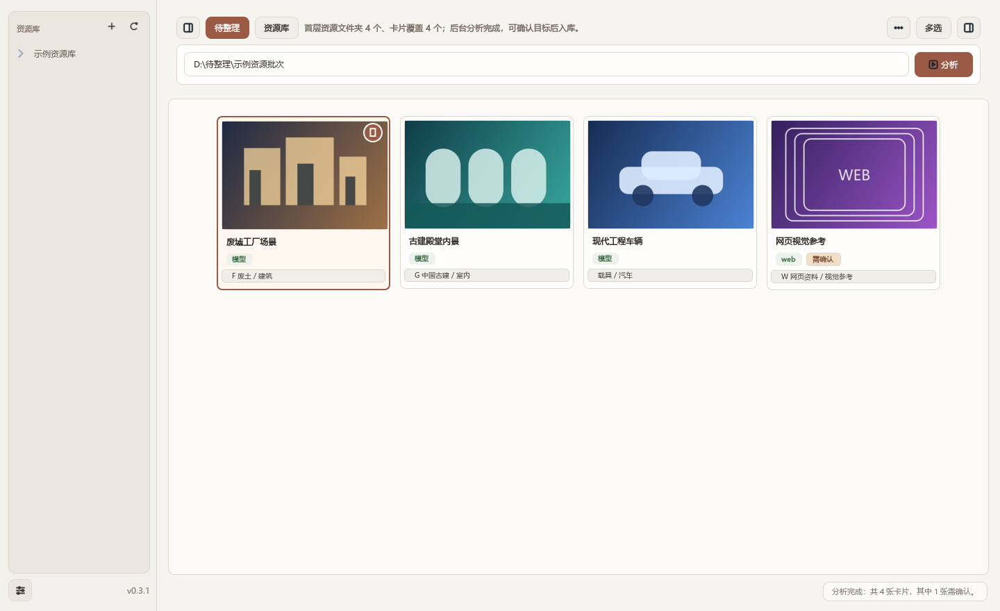
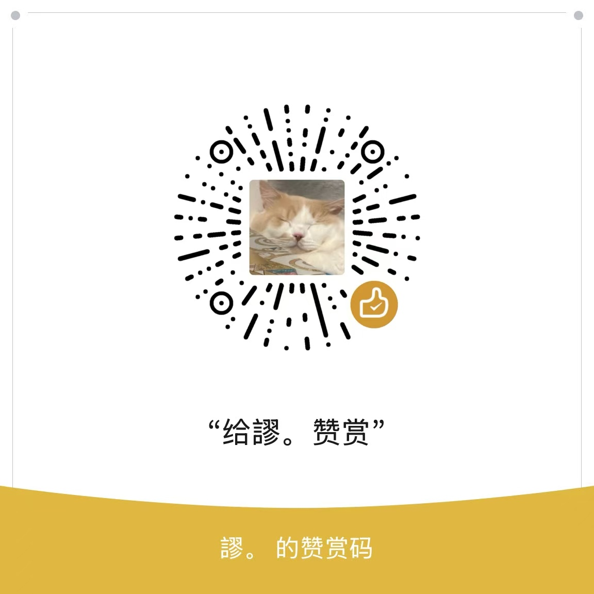

# ResourceWorkbench 资源入库工作台

ResourceWorkbench 把“扫描待整理资源 → 生成 Pinterest 式卡片 → 翻译/审阅 → 推荐分类 → 移动入库”集中在一个 Windows 桌面工作台中。管理单位是完整资源文件夹或网页资源，不是压缩包里的贴图目录和单个文件。

当前版本：`0.3.1`。



## 当前能力

- 一个顶部输入框同时接受本地文件夹、压缩包路径、多个路径和 `http/https` 网页链接。
- 只有点击“分析”或按 Enter 才开始；输入框失焦不会误触发。
- 分析在后台线程运行，卡片区显示流光状态、进度条和独立“取消分析”按钮。
- 默认不读取、不解压、不拆分压缩包内部目录，避免 `textures/maps/normal/roughness` 等贴图碎卡；卡片重新分析入口也明确遵守这一边界。
- 网页优先尝试无界面浏览器截图；ShotDeck / Superhive 被安全验证拦截时生成风格化封面，不退化成 favicon。
- 左侧资源库与中间卡片墙分离：点资源树只做快速浏览，不会覆盖待整理分析结果。
- 资源库叶目录会显示实际图片/视频文件；视频按内容识别，不再因为位于“照片”大类而误标照片。
- 左侧可直接新建文件夹并同步到本地/NAS；当前路径和已展开路径会由文件监听 + 后台轮询自动刷新。
- 资源树枚举和子目录探测在后台完成；单层超过 400 个文件夹时显示“继续加载”，旧任务不会覆盖新的根路径或刷新结果。
- 图片缩放和视频抽帧使用限并发后台队列，不阻塞卡片墙操作。
- SpeedTree 优先匹配同目录 `preview.png` / `<工程名>_preview.png`，排除 AO/Normal/Gloss/Opacity 等贴图；无真实图时显示明确标注的非渲染占位封面。
- 翻译/重命名后会同步刷新卡片、输入路径、资源树和浅层索引。
- 分析阶段直接结合标题、批次语境、文件样例和真实目录树，给出二至四级现有分类与备选，不再停在“模型”大类。
- 成功移动会写入结构化学习样本，之后按用户历史选择提高目标目录排序。
- 正式移动先显示来源、实际落点、文件数与容量，再要求输入精确大写 `MOVE`；取消或输错不会移动。
- 预览、报告、staging、资源索引及已完成历史都有保守保留策略；维护在后台执行，活动任务、可撤销记录与人工元数据不会删除。
- Blender 式语义主题可分别控制窗口、画布、面板、侧栏、卡片、按钮、输入框、正文/弱文字、边框、图标、悬停和选中态。
- Qt 标准按钮和颜色选择器已加载中文翻译；配色窗口提供语义分组、预设、单项恢复和实时预览。

## 启动入口

```text
启动-开发工作台.bat       源码开发，数据写到 .runtime\development
启动-正式工作台.bat       优先运行 dist 中 EXE，数据写到 %LOCALAPPDATA%\ResourceWorkbench
启动-干净分发预览.bat     每次用全新临时目录，模拟另一台电脑首次打开
```

正式版和开发版不再共用设置、API Key、索引或预览缓存。

## 使用

在顶部输入框粘贴以下任意内容，然后点“分析”或按 Enter：

```text
D:\待整理\资源批次
D:\下载\asset.zip
D:\批次一 ; E:\批次二
https://example.com/resource
```

多个输入用分号或换行分隔。分析完成后点击卡片查看详情，使用卡片悬停/右键菜单完成翻译、选择目标、移动或打开来源。

## 开发与验证

```powershell
$env:PYTHONPATH = ".\src"
python -m unittest discover -s tests -v
python -m compileall -q src tests
powershell -ExecutionPolicy Bypass -File .\tools\build_windows_app.ps1
```

打包产物：

```text
dist\ResourceWorkbench\ResourceWorkbench.exe
dist\ResourceWorkbench-0.3.1-win64.zip
```

构建脚本会拒绝包含 `workbench_data`、`settings.json`、`secret.json`、移动日志或资源索引的分发目录。

## 安全原则

- 不自动扫描整块磁盘；只处理用户输入的来源。
- 默认不自动解压，也不深入读取压缩包内部。
- 分类/翻译结果是建议；不确定资源进入审阅队列。
- 正式移动必须先预览计划并输入 `MOVE`，移动后校验数量/容量并写可撤销日志。
- API Key 只写入当前运行环境的 `workbench_data/secret.json`，不进入源码或分发包。
- 清理功能只处理工作台派生缓存、完整且过期的非活动 staging，以及明确终态历史；不删除源资源、活动任务或人工元数据。

## 设计参考与致谢

- 界面结构和按钮交互方向参考了 [NanmiCoder/cc-haha](https://github.com/NanmiCoder/cc-haha) 的轻量顶部栏、干净侧栏和低噪声按钮系统。
- 本项目没有复制 cc-haha 的源码、Logo 或图片资源；视觉实现和图标均在本项目中独立完成。
- 桌面界面基于 PySide6；预览处理使用 Pillow 和 imageio-ffmpeg。各依赖遵循其各自许可证。

## 许可证

ResourceWorkbench 源码以 [MIT License](LICENSE) 发布。第三方依赖仍遵循各自许可证。

## 支持作者

如果这个工具帮到你，欢迎请作者喝杯奶茶。所有支持均为自愿，不影响软件功能、更新或开源许可。



## 文档

- [使用指南](docs/USER_GUIDE.md)
- [Windows 打包](docs/BUILD_WINDOWS_APP.md)
- [SpeedTree 预览说明](docs/SPEEDTREE_PREVIEW.md)
- [版本记录](CHANGELOG.md)
- [贡献指南](CONTRIBUTING.md)
- [安全策略](SECURITY.md)
